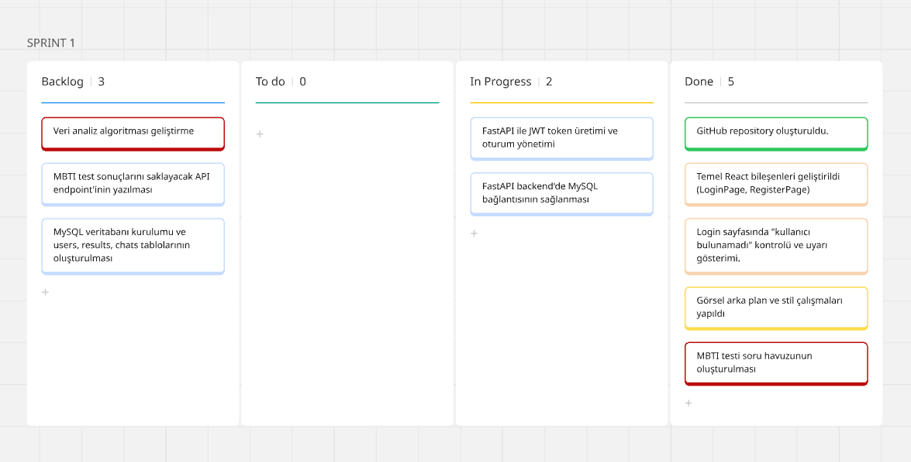
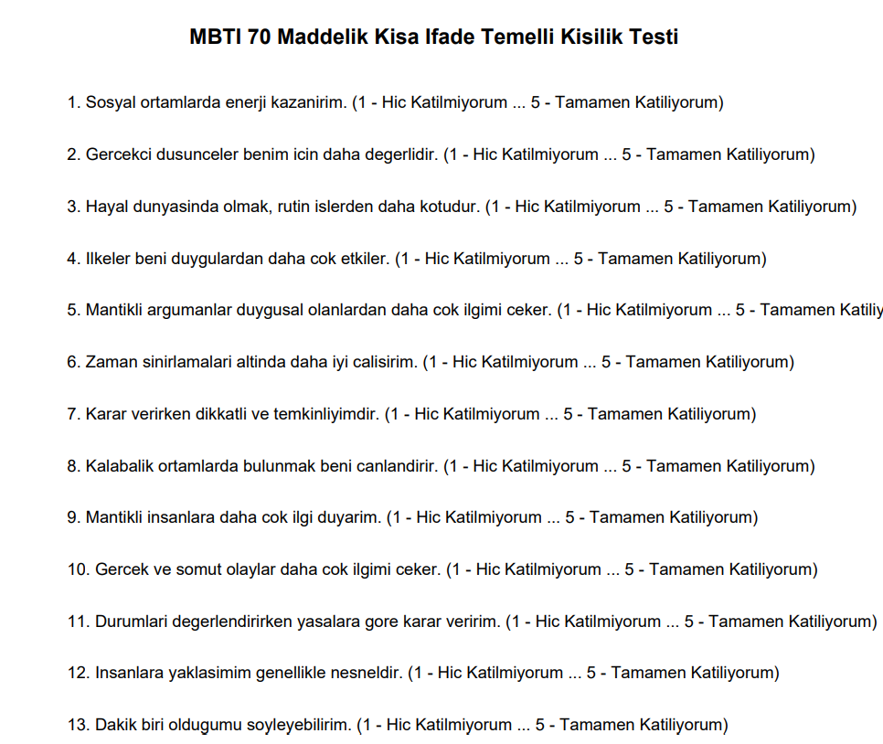

# Takım İsmi

Takım 119 Yapay Zeka

# Takım Üyeleri

| İsim                   | Rol             | Sosyal Medya |
|------------------------|------------------|----------|
| Fatma Didenur Özgüven | Product Owner    |  |
| Efehan Hüsrevoğlu      | Scrum Master     |  |
| Ahmet Efe Akçay        | Developer        |  |
| Yusuf Koğa             | Developer        |  |

# Ürün İsmi

MindHelp

# Ürün Açıklaması

MindHelp, kullanıcıların kendilerini daha yakından tanımalarını sağlamak amacıyla geliştirilen, MBTI (Myers-Briggs Type Indicator) temelli bir kişilik testi uygulamasıdır. Kullanıcı dostu arayüzüyle öne çıkan bu platformda, bireyler e-posta ve şifre ile hızlıca kayıt olabilir, giriş yaparak testi tamamlayabilir ve kişilik tiplerini detaylı analizlerle öğrenebilirler. MindHelp, kişisel farkındalığı artırmak, güçlü yönleri keşfetmek ve potansiyeli daha iyi değerlendirmek isteyen herkes için modern ve güvenli bir çözümdür. Eğitimden kariyer planlamasına kadar birçok alanda içgörü sunan bu uygulama, bireylerin kendilerini daha iyi anlamalarına yardımcı olur.

# 🚀 Ürün Özellikleri

* ✅ MBTI Temelli Kişilik Testi
  
16 farklı kişilik tipine göre kullanıcıların analizini yaparak kapsamlı sonuçlar sunar.

* 🔐 Kayıt ve Giriş Sistemi
  
E-posta ve şifre ile güvenli kullanıcı girişi sağlar; yeni kullanıcılar kolayca hesap oluşturabilir.

* 💬 Sohbet Botu ile Etkileşim

Kullanıcının kişilik tipine göre özel yanıtlar veren yapay zekâ destekli sohbet deneyimi sağlar.

# 🎯 Hedef Kitle

* 👩‍🎓 Üniversite Öğrencileri

Kendini tanımak ve kariyer yolculuğuna daha bilinçli adımlar atmak isteyen genç bireyler.

* 🧑‍💼 İK Uzmanları ve Kariyer Danışmanları

Kişilik profillerini analiz ederek daha uygun pozisyon eşleştirmeleri yapmak isteyen profesyoneller.

* 🧠 Psikoloji Meraklıları

MBTI gibi kişilik testleriyle ilgilenen, psikolojik gelişime önem veren kullanıcılar.

* 🧑‍🤝‍🧑 Bireysel Gelişimle İlgilenen Kişiler

Kendini daha iyi tanımak ve sosyal ilişkilerini geliştirmek isteyen bireyler.

* 🏫 Eğitim Kurumları ve Rehberlik Servisleri

Öğrencilerinin kişilik analizine dayalı rehberlik sağlamak isteyen okullar ve eğitim danışmanları.

# Product Backlog URL

[Click for Backlog (Miro)](https://miro.com/app/board/uXjVIheT0gE=/)

# SPRINT 1

* **Sprint Notları:** MindHelp projesine ait user story'ler, ilgili product backlog kartlarının içerisinde detaylı olarak yer almaktadır. Her backlog kartına tıklanarak bu user story'lerin kapsamı, amacı ve teknik ihtiyaçları okunabilmektedir.
* **Sprint içinde tamamlanması tahmin edilen puan:** 100 puan
* **Puan tamamlama mantığı:** Proje genelinde tahmini toplam iş yükü 300 puan olarak öngörülmüş ve bu yük, 3 sprinte eşit şekilde bölünmüştür. Bu sprint, temel sistem altyapısının kurulması ve ilk fonksiyonların hazırlanması odaklı olarak planlanmıştır.
*  **Backlog düzeni ve story seçimleri:** Sprint 1'de yer alan backlog görevleri, sonraki sprintlerde geliştirilecek modüllerin temelini oluşturacak şekilde sıralanmıştır. Sprint süresince iş gücünü dengelemek amacıyla puan limiti gözetilmiş ve görev dağılımı buna göre gerçekleştirilmiştir.
Miro board’unda görev kartları kategorilere göre renk kodlarıyla ayrılmıştır.Bu renk kodları görev takibini kolaylaştırmak ve ekip içi sorumlulukları netleştirmek amacıyla belirlenmiştir.
* **Daily Scrum:** Daily Scrum toplantıları, ekip üyelerinin günlük ilerlemelerini paylaşmaları ve engelleri belirtmeleri amacıyla her gün WhatsApp grubu üzerinden, gün içindeki müsaitlik durumlarına göre gerçekleştirilmiştir.
Bu esnek yapı, ekip içi iletişimi artırmış ve koordinasyonu sürdürmeye yardımcı olmuştur.
Günlük notlar ve iletişim kayıtları için "Sprint 1 Daily Scrums" kalsörünü inceleyebilirsiniz.
* **Sprint Board Update:**
  
* **Ürün Durumu Ekran Görüntüleri:**
  
 

